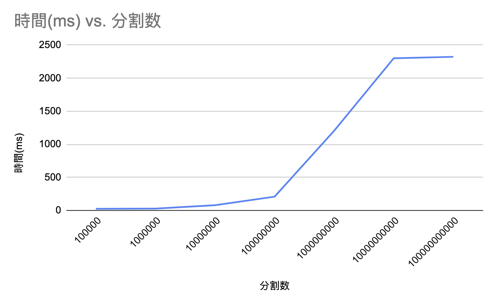

# PCS_2021_Ex01J
s1270174 奥田　龍馬

## 環境

- CPUの種類

    docker in M1 chip (挙動を合わせるため)
- 周波数

    0.6 GHz ~ 3.2 GHz
- コア数

    8コア
- 搭載メモリ量

    6GB
- OSの種類とバージョン

    arch linux(amd64) latest

## 問題1 性能測定(1)

### 課題A

グラフ:
](https://i.imgur.com/DfjggGS.png)

ソースコード(p1.c):
```c
#include <stdio.h>
#include <stdlib.h>
#include <math.h>

double f(double a){
    return (4.0 / (1.0 + a * a));
}

int main(int argc, char *argv[]){
    int n, id, np, i;
    double PI25DT = 3.141592653589793238462643;
    double h, sum, x, mypi;

    // error handling
    if (argc != 2) {
        printf("no enough arguments!");
        exit(0);
    }

    char* n_string = argv[1];

    n = atoi(n_string);

    h = 1.0 / (double)n;
    sum = 0.0;
    // main loop
    for (i = 0; i < n; i++){
        x = h * ((double)i - 0.5);
        sum += f(x);
    }
    mypi = h * sum;

    printf("pi is approximately %.16f, Error is %.16f\n", mypi, fabs(mypi - PI25DT));

    return 0;
}
```

### 課題B

0->1に最適化した時に顕著な差が出た。

- -O0
](https://i.imgur.com/DfjggGS.png)

- -O1


- -O2


- -O3
)

## 問題2 性能測定(2)

結果：
以下の画像のように近い値を取得することができた。


ソースコード(e_time.c):
```c
#include <time.h>
#include <sys/time.h>
#include <sys/resource.h>

double e_time(void){
    static struct timeval now;
    gettimeofday(&now, NULL);
    return (double)(now.tv_sec + now.tv_usec / 1000000.0);
}
```

ソースコード(p2.c):
```c
#include <stdio.h>
#include <stdlib.h>
#include <math.h>

double e_time(void);

double f(double a){
    return (4.0 / (1.0 + a * a));
}

int main(int argc, char *argv[]){
    int n, id, np, i;
    double PI25DT = 3.141592653589793238462643;
    double h, sum, x, mypi;
    double st, en;

    // error handling
    if (argc != 2) {
        printf("no enough arguments!");
        exit(0);
    }

    char* n_string = argv[1];

    n = atoi(n_string);

    st = e_time(); // 計測開始

    h = 1.0 / (double)n;
    sum = 0.0;
    // main loop
    for (i = 0; i < n; i++){
        x = h * ((double)i - 0.5);
        sum += f(x);
    }
    mypi = h * sum;

    en = e_time(); // 計測終了

    printf("pi is approximately %.16f, Error is %.16f\n", mypi, fabs(mypi - PI25DT));

    printf("en - st = %f", en - st);

    return 0;
}

```